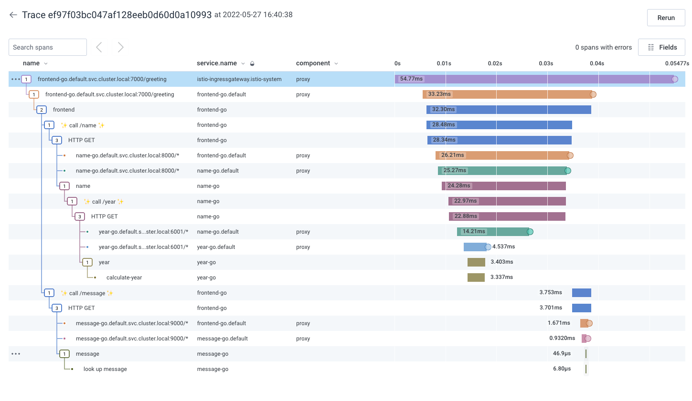

# readme - go services with kubernetes and istio

note: dataset is only needed for classic but since it's still in some code, add it just in case wherever referenced

## setup

### build docker images locally

```shell
cd golang/frontend && docker build -t frontend-go:local .

cd golang/message-service && docker build -t message-go:local .

cd golang/name-service && docker build -t name-go:local .

cd golang/year-service && docker build -t year-go:local .
```

### setup environment variables

anywhere that says <API_KEY> should be replaced with actual api key

### run services in kubernetes

`kubectl apply -f greetings.yaml`

### run collector in kubernetes

`kubectl apply -f otel-collector.yaml`

### check on pods and follow logs

`kubectl get pods`

`kubectl logs <pod-here> --follow`

### curl the greeting

`curl localhost:7000/greeting`

## setup istio service mesh and sidecars

follow instructions to [download istio](https://istio.io/latest/docs/setup/getting-started/#download):

```sh
curl -L https://istio.io/downloadIstio | sh -
cd istio-1.18.2
export PATH=$PWD/bin:$PATH
```

install istio, enable tracing to send to collector: `istioctl install --set profile=demo -y -f ./tracing.yaml`

auto inject sidecar proxies: `kubectl label namespace default istio-injection=enabled`

get pods to kill for next step: `kubectl get pods`

kill pods to get sidecars enabled: `kubectl delete pod <pod-here> <pod-here> <pod-here> <pod-here> <pod-here>`

```shell
export INGRESS_HOST=$(kubectl -n istio-system get service istio-ingressgateway -o jsonpath='{.status.loadBalancer.ingress[0].ip}')
export INGRESS_PORT=$(kubectl -n istio-system get service istio-ingressgateway -o jsonpath='{.spec.ports[?(@.name=="http2")].port}')
export SECURE_INGRESS_PORT=$(kubectl -n istio-system get service istio-ingressgateway -o jsonpath='{.spec.ports[?(@.name=="https")].port}')
export INGRESS_HOST=$(kubectl -n istio-system get service istio-ingressgateway -o jsonpath='{.status.loadBalancer.ingress[0].hostname}')
```

### also add gateway

`kubectl apply -f greetings-gateway.yaml`

### curl the greeting again

`curl localhost/greeting`



## cleanup

``` shell
kubectl delete -f otel-collector.yaml
kubectl delete -f greetings.yaml
kubectl delete -f greetings-gateway.yaml
istioctl manifest generate --set profile=demo | kubectl delete --ignore-not-found=true -f -
istioctl tag remove default
kubectl delete namespace istio-system
kubectl label namespace default istio-injection-
```
